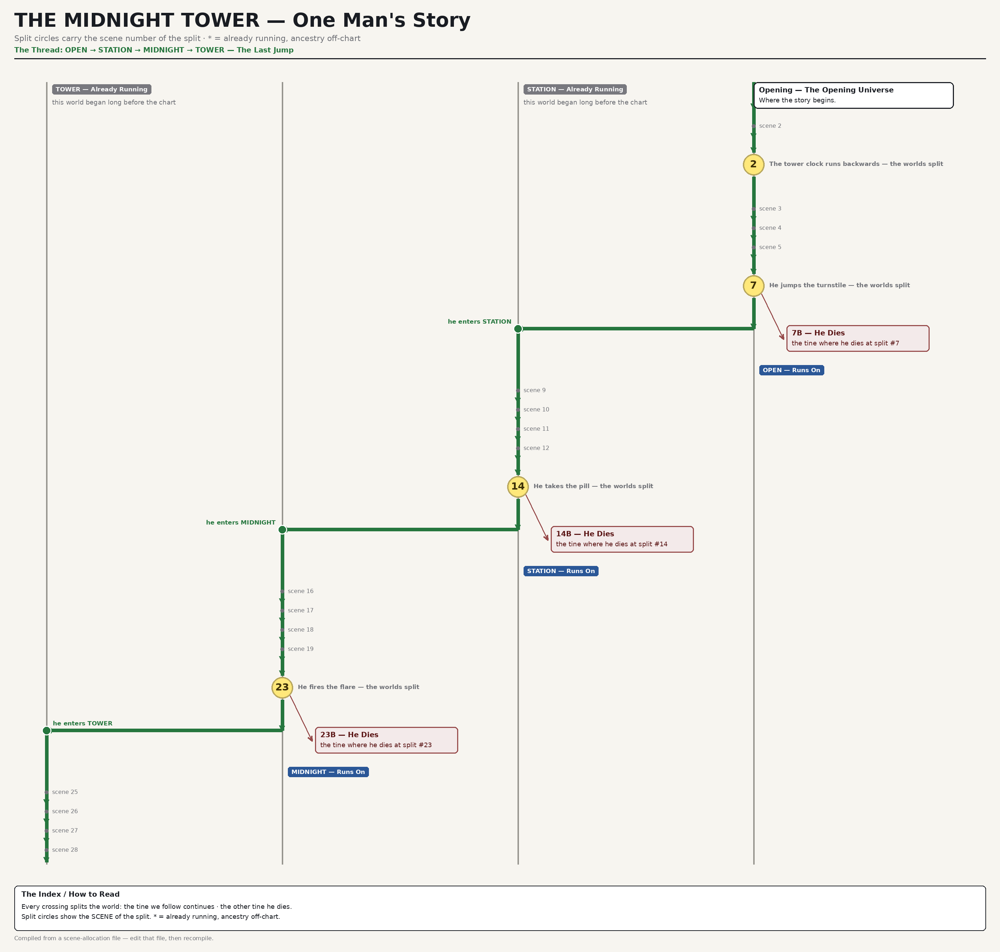

# film-universe-timelines

Primer-style universe timeline charts for films that deal with time travel and
multiple universes. Declarative: you describe the **story** (lanes, splits,
crossings, deaths) in a JSON file or a plain-text allocation file; the engine
computes the geometry and renders publication-grade PNGs in four styles.

Built for THE WAIF (Stephen Fingleton), generalised for any multi-universe film.



## The one rule

**Never draw a "reset".** Every split is permanent. A time-travel act splits the
world in two: one branch where the traveller dies (or fails), one where they
continue. What reads on screen as a rewind is the film following the surviving
branch *into a different universe*. Worlds the traveller joins **already
existed** and were running before they arrived — draw their lanes from the top
of the chart. Full ontology in [`references/chart-language.md`](references/chart-language.md).

## Quick start

```bash
pip install pillow

# 1. describe your film's scenes per universe (plain text, see references/method.md)
#    a worked synthetic example ships in examples/demo-film/demo.universes.txt

# 2. compile it to the chart JSON
python3 tools/timeline_compile.py examples/demo-film/demo.universes.txt \
    -o demo.universes.json \
    --title "THE MIDNIGHT TOWER — One Man's Story" \
    --split-name 7:"He jumps the turnstile — the worlds split"

# 3. render
python3 tools/universe_graph.py demo.universes.json -o demo.png --style dash
```

Or skip the compiler and write the JSON directly — see
[`references/json-schema.md`](references/json-schema.md).

## The four styles

| style    | grammar                                                                 |
|----------|-------------------------------------------------------------------------|
| `classic`| the reference look — heavy green thread, yellow split circles            |
| `weight` | stroke hierarchy — thread heaviest, deaths hairline                      |
| `dash`   | dashed = pre-history / death. Dash carries the backpropagation meaning   |
| `tape`   | transit-map grammar — 45° bends, no arrowheads, flat ink                 |

One JSON renders all four:

```bash
for st in classic weight dash tape; do
  python3 tools/universe_graph.py demo.universes.json -o demo-$st.png --style $st
done
```

## Visual language

- vertical lanes = universes (left→right order set by you)
- **yellow split circle** = a branching act, carrying the scene number
- **red stub box** = the tine where the protagonist dies (forks right, diagonal)
- **green dot + horizontal** = a crossing: the survivor enters an
  already-running world (drawn down-then-across, never a rewind arrow)
- **grey "ALREADY RUNNING" chip** at a lane's top = that world predates the traveller
- **blue "RUNS ON" chip + faded tail** = the abandoned branch keeps existing
- the **green thread** is the film's path — one continuous line, start to ending

Per-film colours: set `meta.node_types` (e.g. `{"death": {"color": [40,40,160]}}`)
and every derived shade (fill, text) follows.

## Design principles

1. **Ground truth ≠ drawing.** The story lives in data; geometry is computed;
   story errors are validation errors, not drawing bugs. The engine refuses to
   render an inconsistent graph (exit 2, no PNG).
2. **Fixed-point layout.** Joins anchor below their source split and everything
   flows down from there; the layout iterates until stable, so nothing is
   clipped and no lane cursor goes stale.
3. **Hand-editing PNGs is forbidden.** Edit the JSON (or the allocation file)
   and recompile. The chart is a build artifact.
4. **Cite the script.** Every beat carries `#scene` numbers so notes can be
   checked against the screenplay.

## Repo layout

```
tools/universe_graph.py     render engine (validator + fixed-point layout + 4 styles)
tools/timeline_compile.py   plain-text scene allocations -> chart JSON
references/                 ontology, JSON schema, production method
examples/demo-film/         synthetic 4-lane demo, allocation -> JSON -> 4 PNGs
tests/                      negative tests: a lying chart must fail loudly
```

## Origin

The engine was built to chart THE WAIF's universe structure — four splits,
three crossings, no resets — after tiling together the fan-made Primer charts
(unrealitymag flowchart, the Clawz114 6K grid, the Wikipedia GIF). The Waif
files themselves are not in this repo; `examples/demo-film/` is a synthetic
film that exercises the same features.

## License

MIT — see [LICENSE](LICENSE).
